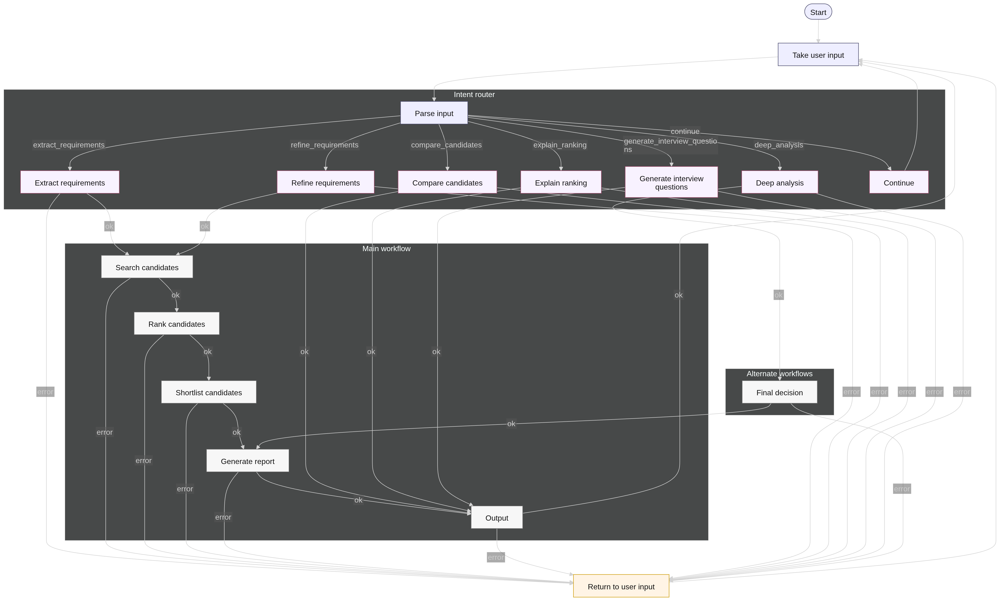

# Agentic Profile Matching 

## State Diagram



---

## Requirements

### 1. Set the `OPENAI_API_KEY` Environment Variable

The application requires a valid Google or OpenAI API key.

#### macOS / Linux

```bash
export OPENAI_API_KEY="your_api_key_here"
```

#### Windows (PowerShell)

```powershell
setx OPENAI_API_KEY "your_api_key_here"
```

Restart your console.

---

## Setup

### Clone the Repository

```bash
git clone https://github.com/ks6201/agentic-profile-matching.git
```

```bash
cd agentic-profile-matching
```

---

## Run the Application

### Recommended: Run Locally with `uv`

#### Additional Requirement (Local Only)

Install `uv`:

##### macOS / Linux

```bash
curl -LsSf https://astral.sh/uv/install.sh | sh
```

##### Windows (PowerShell)

```powershell
irm https://astral.sh/uv/install.ps1 | iex
```

Verify:

```bash
uv --version
```

Restart the terminal if necessary.

---

## Install Dependencies

```bash
uv sync
```

---

## Environment Configuration

Before running migrations or the application, create a `.env` file in the project root.

### Example `.env`

```env
DATABASE=apm_db
DATABASE_USER=postgres
DATABASE_PASS=postgres
DATABASE_HOST=localhost
DATABASE_PORT=5432
```

### Notes

* All database variables are required.
* Ensure the database (`DATABASE`) exists before running migrations.
* Update `DATABASE_HOST` if using Docker or a remote database.
* Default PostgreSQL port is `5432` unless configured otherwise.
* The application and Alembic both depend on these values.
* Install pgvector for your postgres version using this command on debian `sudo apt install postgresql-<version>-pgvector`
* Enable pgvector extension using this `CREATE EXTENSION IF NOT EXISTS vector;`

---

## Database Migrations (Alembic)

Run migrations using the provided scripts.

### Generate Initial Migration

```bash
uv run apm-migrate-init
```

### Apply Migration

```bash
uv run apm-migrate-up
```

---

## Run

### Ingestion Phase

```bash
uv run apm-ingestion
```

### Run App

```bash
uv run apm-app
```
---

## Operational Notes

* Run migrations **before first application start**.
* For schema updates:

  1. Re-run `apm-migrate-init`
  2. Then `apm-migrate-up`
* If migrations fail:

  * Verify DB connectivity
  * Check `.env` values
  * Ensure models are correctly registered in Alembic
